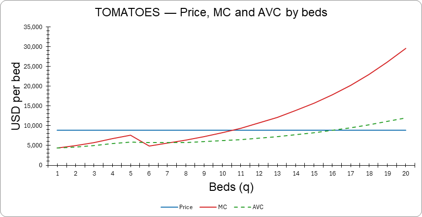
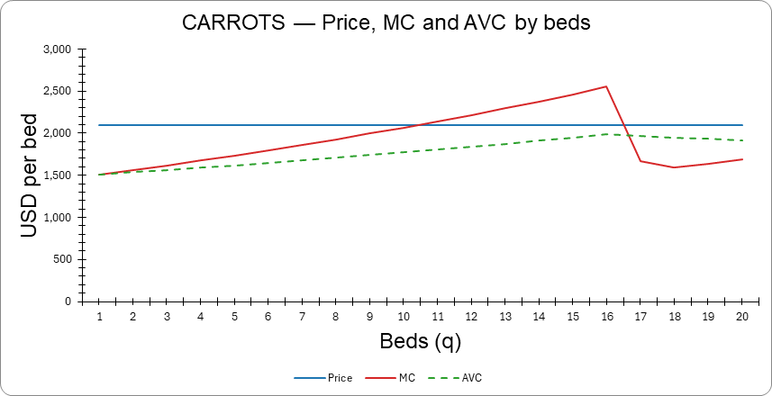
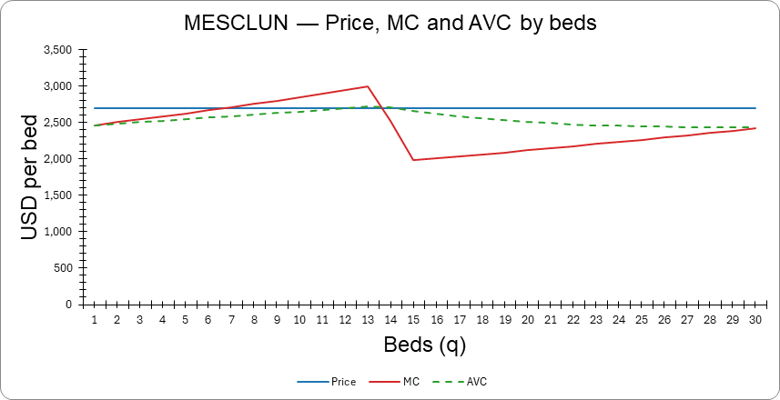
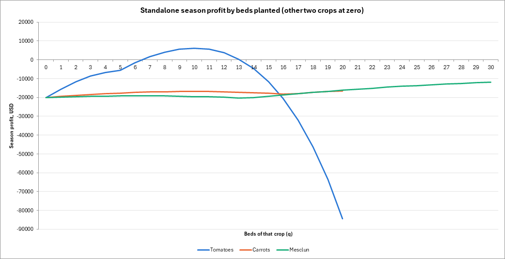

I predicted that the farm would plant 14 tomato beds, 20 carrot beds, and 30 mesclun beds for a total of 64 beds for a total of 64 available beds.  The analysis rejects my original 14/20/30 hypothesis because 14 tomato beds require too much labor.  This is not feasible.  I underestimated that tomato labor costs increased after the 10th bed and tomato production becomes unprofitable.  That predicted plan requires approximately 7,727.70 labor hours, equivalent to 4.87 temporary workers after the farmer’s hours are used, exceeding the four-worker cap.  More importantly, the eleventh tomato bed already has marginal cost above its $8,800 price, so additional tomato beds costs more to produce than it earns.

# What the Marginal-Analysis Model Shows

Four figures, exported from `capabilities/marginal-analysis/model.xlsx`. Every
number below was read out of the workbook in desktop Excel after a full
recalculation. The optimum is 10 tomato beds, 20 carrot, 30 mesclun, 60 beds of
the 64 available, season profit $42,761.66.

---

## 1. Why tomatoes stop at ~10 beds when they are the money crop

Tomatoes earn $8,800 a bed, four times what carrots earn, and the optimizer still
plants half the allowed 20. Figure 1 shows why: revenue per bed is not the
decision variable, marginal cost at the margin is. The red MC curve crosses the
flat $8,800 price line between bed 10 and bed 11 — MC is $8,248.59 at bed 10 and
$9,390.72 at bed 11. Bed 10 still pays for itself, bed 11 does not.

Being the highest-revenue crop earns nothing at the point where the next unit
stops covering its own cost. That is P = MC doing the only thing it does.

The workbook confirms this directly. Moving from the optimum to 11 tomato beds
costs $590.72 of profit; dropping to 9 costs $551.41. Ten is the top of the hill.

---

## 2. Which constraints bind, and what relaxing one is worth

Carrots and mesclun stop for a different reason than tomatoes do. In Figure 2 the
carrot MC curve is still *below* the $2,094 price line at bed 20 — MC there is
$1,688.95. Production has not become uneconomic; the farm has simply run out of
permitted beds. The economics did not end production, a fence did.

That fence has a price, and the workbook gives it:

| Constraint | Status at optimum | Value of one more bed |
|---|---|---|
| Carrot bed cap (20) | **binds** | +$352.49 |
| Mesclun bed cap (30) | **binds** | +$246.47 |
| Total beds (64) | slack — 60 used | — |
| Temp workers (4) | slack — 3.16 used | — |
| Tomato bed cap (20) | slack — 10 used | — |

Those two numbers are shadow prices, and they are directly actionable: they say
which ground is worth acquiring and roughly what to pay for it. The slack
constraints matter just as much. Total beds and temp-worker capacity never bind,
so a dollar spent on either buys nothing. Neither does a dollar spent lifting the
tomato cap — tomatoes stop at 10 by economics, well short of their 20-bed limit.

One caution on using the shadow prices. They are marginal values that decay as
you relax the constraint: carrot beds 21 through 26 are worth $352, $298, $242,
$183, $123, and $61 in turn. The first extra bed is worth $352; the sixth is
worth almost nothing. Shadow prices price the *next* unit, not an unlimited
expansion. Note also that beds 25 and 26 push total beds past 64, so past bed 24
the land constraint starts binding too and the numbers stop being a pure carrot
story.

---

## 3. The tomato MC dip at ~6 beds

Look again at Figure 1, between beds 5 and 7. Marginal cost falls from $7,660.86
to $4,906.28, then resumes climbing. Diminishing returns never paused — hours per
bed rose the whole way, from 724.73 cumulative hours at bed 5 to 956.64 at bed 6.

What changed is the price of the marginal hour. The farmer's own 720 field hours
cost $34.72/hr and run out during bed 5 (at 5 beds the schedule uses all 720
permanent hours and its first 4.73 temporary hours). From bed 6 on, the marginal
hour is temp labor at $17.36/hr. The wage halves, and for one bed that drop
outweighs the extra hours. Then diminishing returns win again and MC climbs
through the price line at bed 11.

The same step appears in both other crops, at the bed where each exhausts the 720
hours on its own: carrots at bed 17 (Figure 2, MC drops from $2,552.10 to
$1,670.90) and mesclun at bed 14 (Figure 3, $2,988.40 to $2,522.58).

The general lesson outlasts the example: marginal cost reflects input prices as
much as physical returns. Any real cost curve with a step change in an input
price will do this. An analysis that smooths over the dip has smoothed over the
most interesting thing in the model — and, in this model, has also lost the
reason the P ≈ MC point is ambiguous at all, since a non-monotonic MC crosses the
price line more than once.

---

## 4. Why grow crops that lose money on their own

Figure 4 plots season profit for each crop grown *alone*, the other two at zero
beds. Carrots lose money at every quantity — their best standalone showing is
−$16,488.92 at 20 beds. Mesclun likewise: best is −$11,922.19 at 30 beds. Yet the
optimum plants all 20 carrot beds and all 30 mesclun beds.

The resolution is MC versus AVC. The $20,000 of fixed cost is paid whether or not
anything is planted, so it has no business in the planting decision. What matters
is whether price covers *average variable* cost, and at the planted quantities it
does with room to spare:

| Crop | Planted | AVC there | Price | Contributes |
|---|---|---|---|---|
| Tomatoes | 10 | $6,182.72 | $8,800 | yes |
| Carrots | 20 | $1,918.45 | $2,094 | yes |
| Mesclun | 30 | $2,430.74 | $2,700 | yes |

Every bed contributes toward fixed costs the farm owes anyway. Together the three
crops clear $62,761.66 over variable cost, which covers the $20,000 and leaves
$42,761.66. Standalone crops "lose money" only because each is being asked to
carry the whole $20,000 alone.

This is the short-run shutdown rule in farm clothes, and it is the most
transferable idea here — the same reasoning that keeps an airline flying a
half-empty route, or a factory running a line that does not cover its share of
the building.

**Two corrections to the intuition, both from the workbook.** First, tomatoes are
*not* a money-loser standalone: they clear $6,172.77 at 10 beds, so the "every
crop loses money alone" framing holds for carrots and mesclun but not for all
three. Tomatoes are the one crop that could carry the fixed costs by itself.

Second, price does *not* exceed AVC everywhere — it exceeds AVC at the quantities
actually chosen, which is the claim the decision needs. Tomato AVC passes $8,800
at bed 16 and reaches $12,016.72 by bed 20; mesclun AVC peaks at $2,716.35 at bed
13, just above its $2,700 price, before falling back. Those regions are visible in
Figures 1 and 3 as the green AVC line rising above the blue price line. They are
also regions the optimizer never visits, which is the point: the shutdown rule is
evaluated where you plan to operate, not across the whole domain.

---

## Reproducing the figures

Figures 1–3 are the workbook's own charts on the **MC Schedules** sheet, exported
to PNG. Figure 4 is built from the same workbook by setting each crop's beds from
0 to its cap with the other two at zero and reading `PROFIT` at each step.
